# Tamwelly Task

A Flutter mobile application created as a test task demonstrating multiple Flutter development skills including UI, animations, state management with BLoC, responsive design, API integration, and offline handling.

## 📱 Screens Overview

### 1. Splash Screen
Displays a loading animation simulating data loading.  
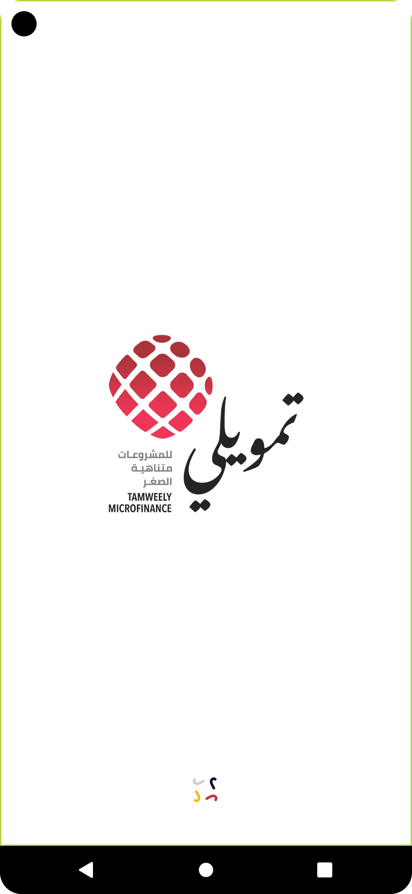

### 2. Intro Screen
Lottie animation with a welcome message.  
Language selection dropdown and "Start" button.  
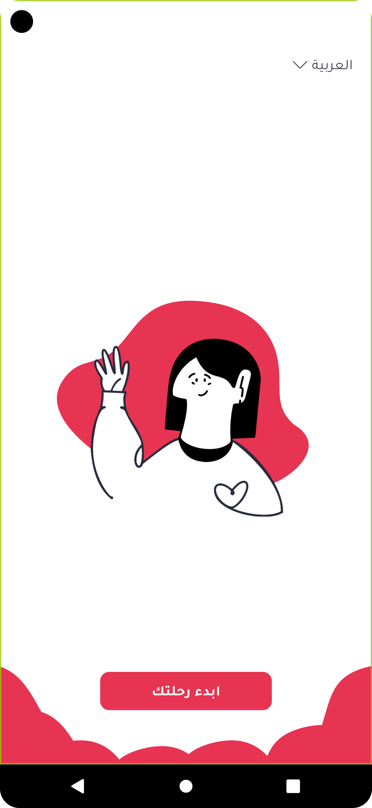

### 3. Home Screen
Displays the company logo and four main navigation buttons:
1. Contact Us
2. Products
3. Submit Complaint
4. About Us  
   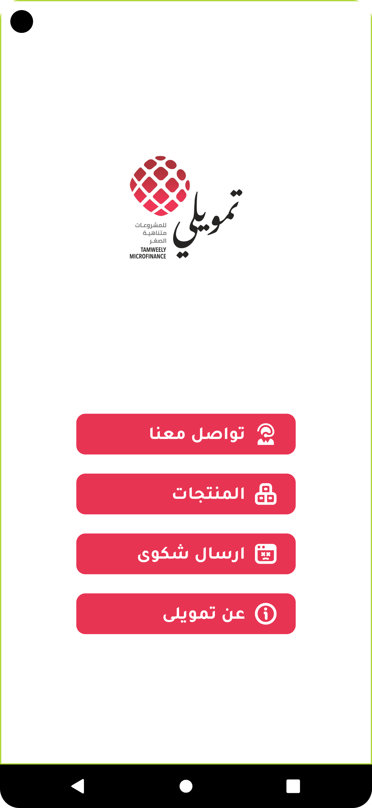

---

## 🔹 Contact Us Screen
- Gradient app bar with a back button and title.
- Contact form with validation.
- Two quick contact methods:
    - WhatsApp: opens WhatsApp message to the company number.
    - Gmail: opens email intent.

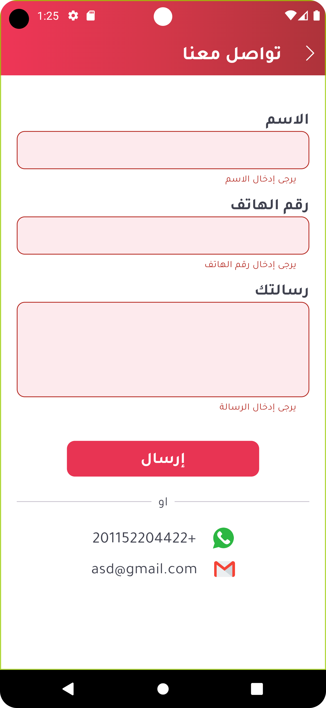

---

## 🛍️ Products Screen
- Fetches products from a dummy API.
- Responsive design:
    - 1 item per row on phones.
    - 2 items on wide phones.
    - 3 items on tablets.
- Shimmer loading shown while fetching data.
- State managed using BLoC.

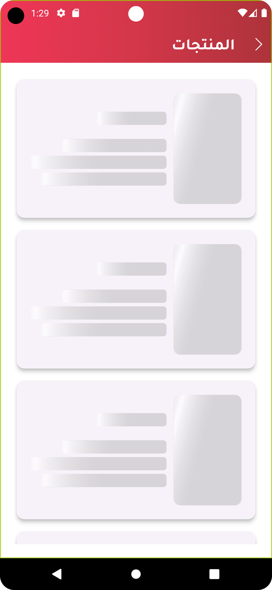  
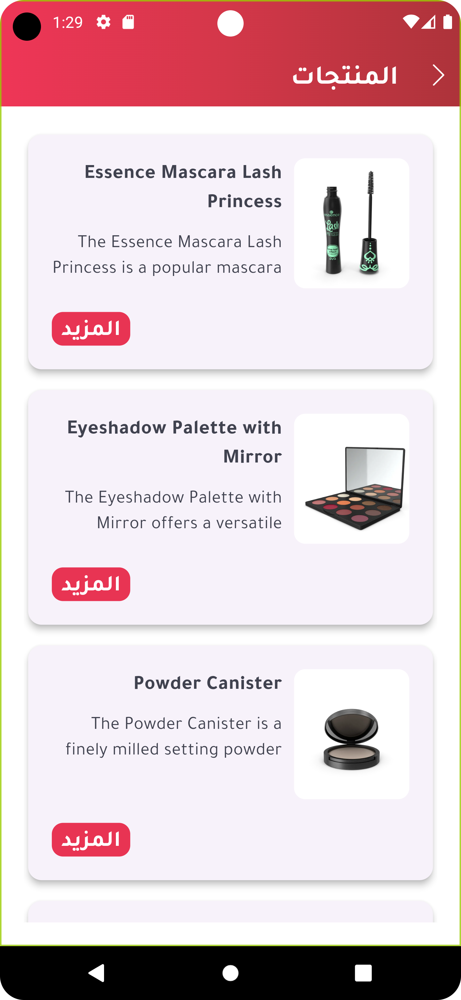  
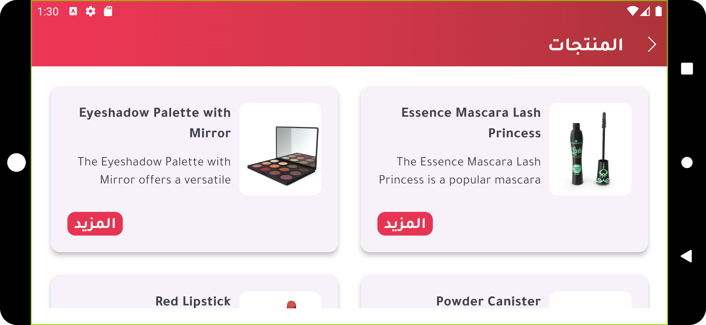

---

## 📩 Submit Complaint Screen
- Form with validation for all inputs.
- Dropdown for selecting complaint type fetched from dummy API via BLoC.
- Submit button shows loading indicator during request.

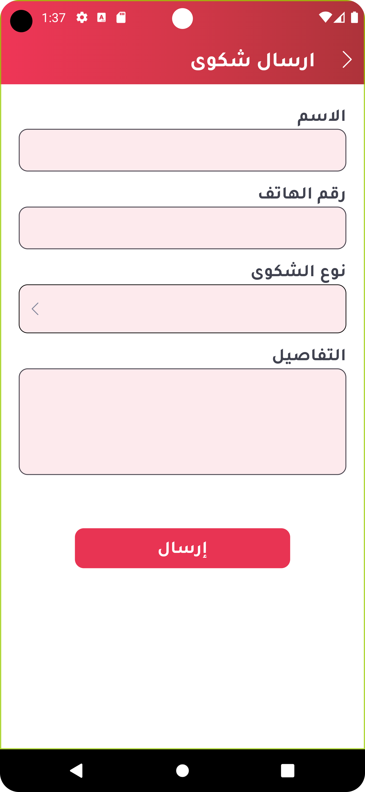  
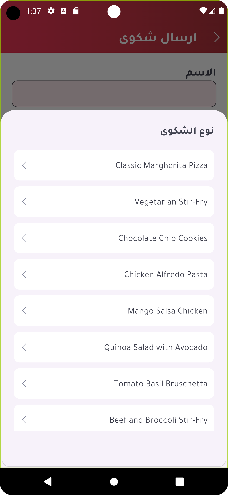

---

## 🏢 About Us Screen
- Image slider with pictures from the company website.
- Overview, mission, and vision sections.
- Live map using **OpenStreetMap** to show company location (no Google API key required).

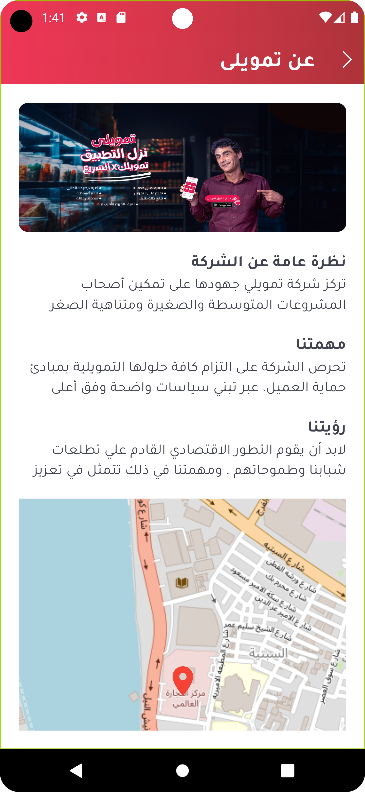

---

## 📶 Offline Banner
- Across the app, a persistent top banner shows when internet is lost.

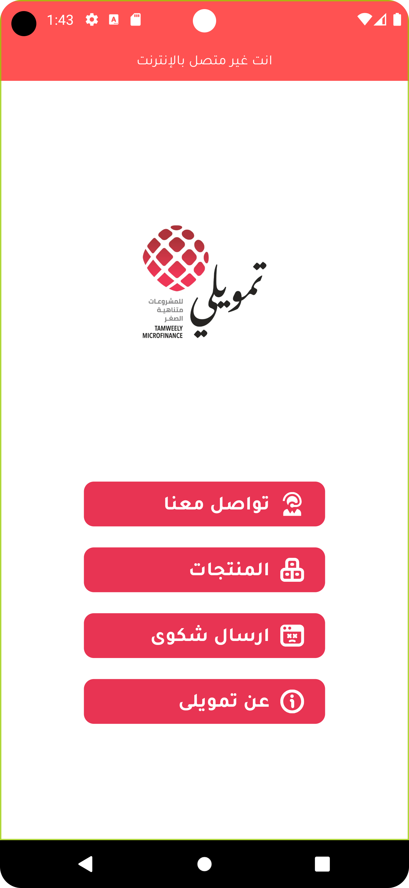

---

## 🔧 Tech Stack

- Flutter
- BLoC (state management)
- Lottie
- OpenStreetMap
- Shimmer effect
- REST API integration
- Responsive UI design

---

## 🚀 Getting Started

1. **Clone the repo:**
   ```bash
   git clone https://github.com/your-username/tamwelly-task.git
   cd tamwelly-task
